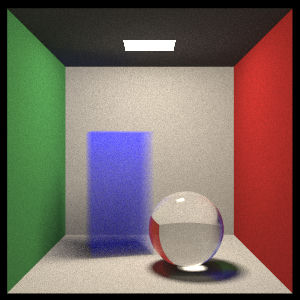

# Toy Ray Tracer

## 简介

- 上海交通大学，2020级ACM班，PaperL
- 2020-2021学年暑期小学期，PPCA课程项目
- **初步掌握Rust语言**
- **学习光线追踪入门知识**

## Module Tree

- **create**
  - scene
  - **basic**
    - vec3
    - ray
    - camera
    - onb
  - **hittable**
    - **instance**
      - translate
      - rotate_y
      - flip
    - **object**
      - sphere
      - moving_sphere
      - rectangle
      - cube
      - constant_medium
  - **bvh**
    - aabb
    - bvh_node
  - **material**
    - lambertian
    - metal
    - dielectric
    - diffuse_light
    - isotropic
  - **pdf**
    - cos_pdf
    - hittable_pdf
  - **texture**
    - solid_color
    - checker_texture
    - image_texture

## 当前版本运行结果缩略图

> 图为封闭的康奈尔盒子
>
> 运行指令 `make run-release`
>
> 代码检查指令 `clippy --all-targets --all-features`
>
> 部分版本运行结果由 GitHub Action 自动生成并上传至 Release

## 待完成工作

- 实现三角形
- 实现obj格式文件输入
- 实现 BvnNode 数据在编译期计算完成