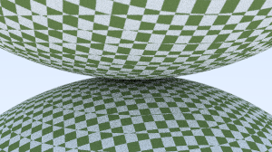

# Toy Ray Tracer

## 简介

- 上海交通大学，2020级ACM班，PaperL
- 2020-2021学年暑期小学期，PPCA课程项目
- **初步掌握Rust语言**
- **学习光线追踪入门知识**

## Module Tree

- main.rs
  - basic
    - vec3
    - ray
    - camera
  - hittable
    - sphere
    - moving_sphere
  - bvh
    - aabb
    - bvh_node
  - material
    - lambertian
    - metal
    - dielectric
  - texture
    - solid_color
    - checker_texture

## 当前Commit运行结果预览图

> 高清渲染图见 Release